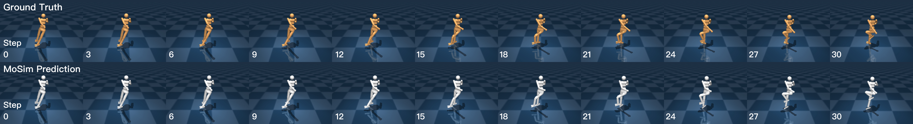
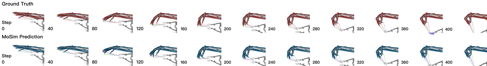

# 🌀 Neural Motion Simulator (MoSim)

Official implementation of:

**[Neural Motion Simulator: Pushing the Limit of World Models in Reinforcement Learning](https://oamics.github.io/mosim_page/)**  

🌐 [Project Page](https://oamics.github.io/mosim_page/) | 📄 [arXiv](https://arxiv.org/abs/2504.07095) | [ Checkpoints](https://huggingface.co/wujiss1/MoSim_checkpoints)


---

## 🎯 Visual Comparisons

<p align="center">
  <br/>
  <br/>
  
</p>

> For more visual results, including video comparisons across agents, please visit our [website](https://oamics.github.io/mosim_page/).


---

## 🛠️ Setup & Training

Before training or evaluation, please make sure to install MoSim as a developer package and configure the environment properly.

### 🔹 Step 1: Install MoSim in editable mode

Navigate to the root directory of this repository and run:

```bash
pip install -e .
```

### 🔹 Step 2: Replace the Corresponding Package Files

We provide modified versions of both `dm_control` and `myosuite` packages. To apply these changes, simply unzip the corresponding files in the `assets/` folder and replace the existing package directories in your local environment.

#### ✅ Instructions:

1. Unzip the following files provided in the `assets/` folder:
   - `suite.zip` → for `dm_control`
   - `myo_sim.zip` and `envs.zip` → for `myosuite`

2. Replace the original directories with the unzipped folders:

   - **For `dm_control`**  
     Replace the contents of:
     ```
     <your_python_env>/lib/pythonX.Y/site-packages/dm_control/suite
     ```
     with the extracted files from `suite.zip`.

   - **For `myosuite`**  
     Replace the contents of:
     ```
     <your_python_env>/lib/pythonX.Y/site-packages/myosuite/simhive/myo_sim
     ```
     with the extracted files from `myo_sim.zip`, and:
     ```
     <your_python_env>/lib/pythonX.Y/site-packages/myosuite/envs
     ```
     with the extracted files from `envs.zip`.

---

> 💡 **Tip:** To find the actual location of these packages, run the following commands in your environment:

```bash
python -c "import dm_control; print(dm_control.__file__)"
python -c "import myosuite; print(myosuite.__file__)"
``` 

### 🔹 Step 3: Start Training

You can start training with the following command:
``` 
python train.py --config config/file/path --device cuda:0
```
To train a zero-shot reinforcement learning agent with MoSim, use the following command:
```
python src/oprl/configs/tqc.py --env cheetah-run-MoSim --device cuda:2
```


## 📚 Citation

If you find our work useful, please consider citing:

```bibtex
@InProceedings{Hao_2025_CVPR,
    author    = {Hao, Chenjie and Lu, Weyl and Xu, Yifan and Chen, Yubei},
    title     = {Neural Motion Simulator Pushing the Limit of World Models in Reinforcement Learning},
    booktitle = {Proceedings of the Computer Vision and Pattern Recognition Conference (CVPR)},
    month     = {June},
    year      = {2025},
    pages     = {27608-27617}
}
